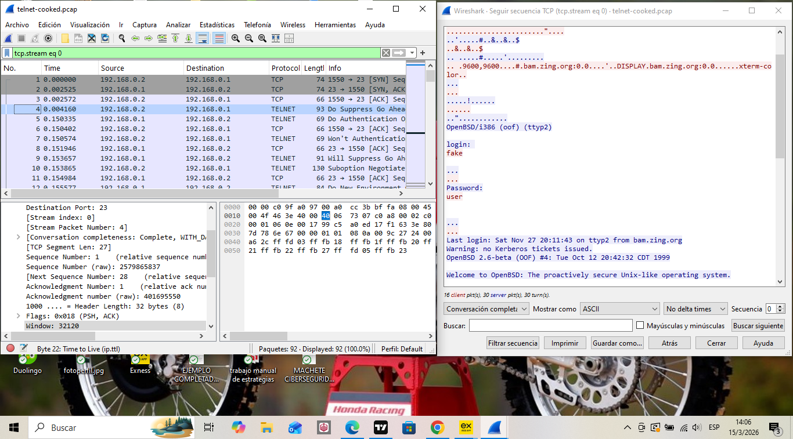

# Análisis de Tráfico de Red: Protocolo Telnet Inseguro

## 📌 Objetivo
Demostrar la vulnerabilidad del protocolo Telnet al transmitir información en texto plano y cómo un analista puede interceptar credenciales mediante el análisis de paquetes TCP con Wireshark.

## 🛠️ Herramientas utilizadas
* **Wireshark:** Para el análisis del archivo de captura (.pcap).
* **Filtros de visualización:** `tcp.stream eq 0`.
* **Seguimiento de flujo:** Seguimiento de secuencia TCP (TCP Stream).

## 🔍 Hallazgos y Evidencia
Al realizar el seguimiento del flujo TCP, se logró reconstruir la sesión de acceso. Debido a que Telnet no utiliza cifrado, las credenciales son totalmente visibles:

* **Usuario capturado:** fake
* **Contraseña capturada:** user

### Evidencia del análisis:

## 💡 Recomendación de Seguridad
Se recomienda deshabilitar el servicio Telnet y reemplazarlo por **SSH (Secure Shell)**, el cual cifra la comunicación de extremo a extremo.
